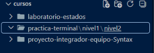
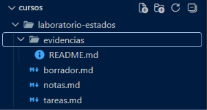

# Reporte de Laboratorio 2: Git a fondo

En la *parte A* de este laboratorio, trabajé con moverme a lo largo de carpetas directamente desde una terminal, creando carpetas con **mkdir**, verificando en qué carpeta estoy con **pwd**, verificando el contenido de la carpeta en la que estoy con **ls** y moviéndome en las carpetas con **cd**, ya sea hacia adelante, con **cd nombre_de_archivo** o con **cd ..** para regresar a un nivel anterior.

Para la *parte B*, trabajé con deshacer acciones en diversas etapas del staging y observando las diferencias (y consecuencias) de cada comando. Con **git restore**, se pierden los cambios que haya hecho porque nunca se llegaron a trackear dichos cambios, pero con **git restore --stashed** se sacan los cambios del área de preparación y se mantienen aplicados los cambios